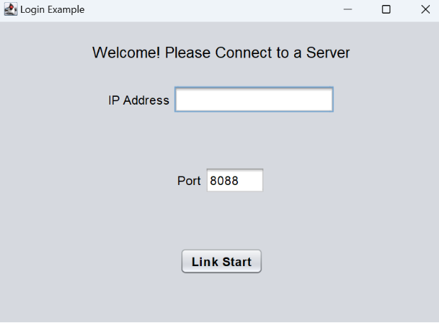
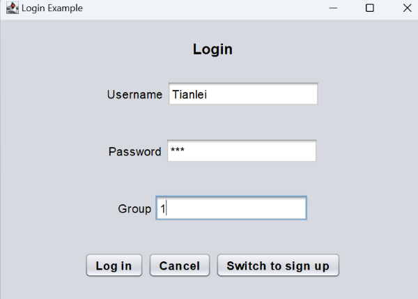
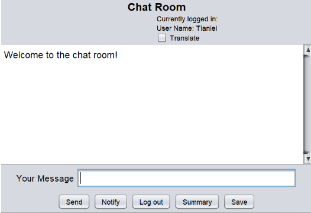

## What is EfficienTalk?

EfficienTalk is an all-in-one collaboration tool that specializes in
enhancing team efficiency through a multitude of features such as
chatting, data storage, real-time translation, and more.

## Key Features

- **Online Chatting**: It allows multiple users to chat with
colleagues, friends, or families. 
- **Summarization & Save**: It provides a concise summarization of chat records, which captures the core of discussions. 
- **Translation**: It offers translating
options for users to communicate without barriers. 
- **Notification**: It allows group leaders to publish announcements
directly to all members' emails.

## Use Cases

### clear_users 
Clears all user data from the local storage.

### connect 
Establishes a connection with the server for real-time
communication.

### login 
Allows a user to log in to their account using their
credentials.

### logout 
Enables a user to securely log out of the application.

### notify 
Sends notifications to users, which can also be sent as
email reminders.

### save 
Stores conversations, files, or summaries locally or in the
cloud.

### send_message 
Facilitates sending messages between users or groups.

### signup 
Registers a new user to the application with necessary
details.

### summary 
Generates a concise summary of a conversation or meeting.

### switchtologin 
Navigates the user to the login interface from other
screens within the app.

### switchtosignup 
Navigates the user to the signup interface from
other screens within the app.

### translate 
Utilizes the Baidu translation API to translate text
between various languages.

## Installing 
### A note on dependencies EfficienTalk requires Java 17
to run 
### Set up Clone this Github repository:
https://github.com/yulong-wu-jackson/EfficienTalk.git 

Open an IDE that
you are familiar with. Below, we use screenshots from IntelliJ IDEA as
an example. Select File-\>New-\>Project from version control.

Paste the repository URL and select "clone"

In the pop-up window, select Trust Project -\> Open in new window

## Usage

Firstly, run Server.java under the directory Server\\src\\app

After you run Server.java successfully, run ClientApp.java under the
directory src\\app. Note: this src directory is different from the above
src directory.

In the pop-up window, enter a valid IP address and enter the port
8088.For example, if you are using window, click Window Key+R, enter
cmd, type ipconfig, copy and paste the ipv4 address shown.

In the Signup window, choose your username and password, enter a valid
email address, then press Sign up.

After signing up, you have an account stored in our database! You will
be switched to the login window, where you can enter your username and
password, and a random group number(we haven't fully developed our group
function yet) to log in.

After logging in, you will see a chatroom window. Notice the few buttons
here. The "send" button sends your message to the chat room so that
other users logged in to this chat room can see the message. The
"Notify" button is responsible for sending your message to the email
addresses of all user accounts stored in our database (given that the
email address is valid). The "Summary" button uses high-level AI to
write a summary paragraph of all the messages sent by different users in
the chat room. The "Save" button saves the dialogues in this chat room
to a separate text file. The "Translate" checkbox above translates the
content in the chatroom into Chinese.

## Contact q.chu@mail.utoronto.ca

tianlei.pang@mail.utoronto.ca
